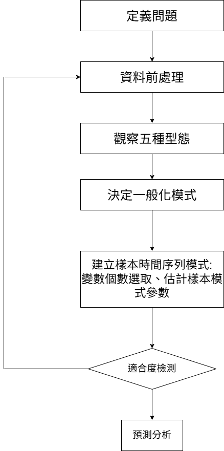

# chatper01 時間資料分析

本章將介紹時間資料分析的基本概念與應用。

## 前言

時間序列資料是一組按照時間順序排列的數據點，常見於經濟、金融、氣象與生物醫學領域。
時間序列分析的核心目標是透過歷史數據觀察變化趨勢，並預測未來的可能走勢。

## 時間序列類型

時間序列可以分為以下幾種類型：

- **平穩型 (Stationary Time Series)**：統計特性（均值、變異數）在時間上保持不變。例如某些財經指標的日波動率。
- **無定向型 (Non-Stationary Time Series)**：統計特性隨時間變化，如股票市場指數。
- **趨勢型 (Trend Time Series)**：數據隨時間呈現明顯增長或下降的趨勢，例如全球氣溫變化。
- **季節型 (Seasonal Time Series)**：數據隨時間週期性變化，如每年的電力消耗模式。
- **介入事件型 (Intervention Time Series)**：某個事件影響數據變化，例如政策變更後的經濟數據。

### 五種類型的示意圖

```{r time-series-types, echo=TRUE}
library(ggplot2)
set.seed(123)
time <- 1:100

# 生成不同類型的時間序列
stationary_series <- ts(rnorm(100, mean = 50, sd = 5))
non_stationary_series <- ts(cumsum(rnorm(100)))
trend_series <- ts(50 + 0.5 * time + rnorm(100, sd = 3))
seasonal_series <- ts(50 + 10 * sin(2 * pi * time / 12) + rnorm(100, sd = 3))
intervention_series <- ts(50 + c(rep(0,50), rep(20,30), rep(10,20)) + rnorm(100, sd = 3))

# 繪製圖表
ggplot(data = data.frame(time, value = stationary_series), aes(x = time, y = value)) +
  geom_line() + ggtitle("平穩型 (Stationary Time Series)")

ggplot(data = data.frame(time, value = non_stationary_series), aes(x = time, y = value)) +
  geom_line() + ggtitle("無定向型 (Non-Stationary Time Series)")

ggplot(data = data.frame(time, value = trend_series), aes(x = time, y = value)) +
  geom_line() +
  geom_smooth(method = "lm", se = FALSE, color = "red") +
  ggtitle("趨勢型 (Trend Time Series) - 含趨勢線")

ggplot(data = data.frame(time, value = seasonal_series), aes(x = time, y = value)) +
  geom_line() +
  facet_wrap(~cut(time, breaks=5), scales="free_x") +
  ggtitle("季節型 (Seasonal Time Series) - 分五個時段")

ggplot(data = data.frame(time, value = intervention_series), aes(x = time, y = value)) +
  geom_line() +
  ggtitle("介入事件型 (Intervention Time Series) - 影響後下降")
```

## 時間序列的分析步驟

```{r, echo=FALSE}

```

### **時間定義分析法（Analysis in Time Domain）**
模式建構、參數估計、資料的適合度檢定，需適中的觀測值。

- **移動平均法 (Moving Average, MA)**：平滑數據以減少短期波動，分成 移動平均法、加權移動平均法、指數平滑法。 

- **自回歸 (Autoregressive, AR) 模型**：使用過去數值來預測未來數值。

- **ARIMA（自回歸整合移動平均）模型**：綜合 AR 和 MA 方法，適用於非平穩序列。依照各類模型可以依照 ARMA、ARIMA、SARIMA 進行選擇

範例：
```{r time-domain-example}
library(forecast)
ma_series <- ma(time_series_data, order = 5)  # 計算 5 期移動平均
plot.ts(ma_series, main = "移動平均時間序列", ylab = "數值", xlab = "時間")
```

### **頻率定義域分析法（Analysis in Frequency Domain）**
(書籍沒有說)頻率定義分析法關注數據的周期性變化，主要使用頻譜分析（Spectral Analysis）來檢測週期成分。常見技術：
- **傅立葉變換 (Fourier Transform)**：將時間序列轉換為頻率域表示。
- **功率譜密度 (Power Spectral Density, PSD)**：用來測量不同頻率成分的能量分佈。

範例：
```{r frequency-domain-example}
spectrum(time_series_data, main="功率譜密度圖")
```

##模式選擇與建立

自我相關函數(ACF) 與 偏自我相關函數(PACF) 經常搭配使用以檢驗時間序列型態


## 時間序列平滑法
分成 
1.移動平均法
2.加權移動平均法
3.指數平滑法

## R 語言中的時間序列分析

### 載入必要套件

```{r setup, include=FALSE}
library(ggplot2)
library(forecast)
library(tseries)
library(TSA)
```

### 產生模擬時間序列數據

```{r generate-time-series}
set.seed(123)
time_series_data <- ts(rnorm(100, mean = 50, sd = 10), frequency = 12, start = c(2020, 1))
plot.ts(time_series_data, main = "模擬時間序列數據", ylab = "數值", xlab = "時間")
```

### 平穩性檢定 (ADF Test)

```{r adf-test}
adf_test_result <- adf.test(time_series_data)
print(adf_test_result)
```

### 自相關與偏自相關圖

```{r acf-pacf}
par(mfrow=c(1,2))
acf(time_series_data, main="自相關函數 (ACF)")
pacf(time_series_data, main="偏自相關函數 (PACF)")
```

### ARIMA 模型擬合與預測

```{r arima-model}
arima_fit <- auto.arima(time_series_data)
summary(arima_fit)
forecast_values <- forecast(arima_fit, h=12)
plot(forecast_values, main = "ARIMA 預測結果")
```

### 書本的範例:二氧化碳圖形檢視

```{r example}
library(forecast)
library(TSA)
data(co2,package = "datasets")
tsdisplay(co2)

# 將 co2 資料轉換為矩陣格式
co2_matrix <- matrix(data = co2, 
                     ncol = 12, 
                     byrow = TRUE, 
                     dimnames = list(1959:1997, month.abb))

# 將矩陣轉換為資料框
co2_dataframe <- as.data.frame(co2_matrix)

co2_dataframe <- co2_dataframe[, c( month.abb)]  # 調整欄位順序

# 查看格式化後的資料
print(co2_dataframe)

```
### 書本的範例:二氧化碳一二階差分圖形檢視

```{r example_1st}

# 建立訓練集和測試集
train <- ts(co2[seq(1, length(co2) - 12)], frequency = 12, start = c(1959, 1))
test <- ts(co2[seq(length(co2) - 11, length(co2))], frequency = 12, start = c(1971, 1))

# 畫出差分後的時序圖
tsdisplay(diff(train), main = "First difference of CO2")
tsdisplay(diff(diff(train), lag = 12), main = "First and seasonal difference of CO2")


```

### 書本的範例:二氧化碳模式參數估計

```{r example_ARIMA}

# 訓練 ARIMA 模型
ml <- Arima(train, order = c(0, 1, 3), seasonal = list(order = c(0, 1, 1), period = 12))

# 顯示模型係數
ml$var.coef

# 模型診斷檢查
tsdiag(ml, gof = 36)

# 繪製殘差的 QQ 圖
qqnorm(residuals(ml))
qqline(residuals(ml))

# 添加圖例顯示 Shapiro-Wilk 檢驗的 p-value
legend("topleft", legend = paste("p-value =", 
       round(shapiro.test(residuals(ml))$p.val, 4)))


```
### 書本的範例:二氧化碳模式參數調整

```{r example_ARIMA_adjustment}

# 設定部分固定參數
fix.par <- rep(NA,10);
fix.par[c(2,4:8)] = 0

# 建立 ARIMA 模型
ml <- Arima(train, 
            order = c(0, 1, 9), 
            seasonal = list(order = c(0, 1, 1), period = 12), 
            fixed = fix.par)

# 檢查模型的參數估計值
ml$var.coef

# 模型診斷檢查
tsdiag(ml, gof = 36)

# 繪製殘差的 QQ 圖
qqnorm(residuals(ml))
qqline(residuals(ml))

# 添加 Shapiro-Wilk 檢驗的 p 值到圖例
legend("topleft", 
       legend = paste("p-value =", 
                      round(shapiro.test(residuals(ml))$p.value, 4)))

```


此文件可以在 RStudio 的 R Markdown 環境中執行，以進行時間序列分析。
